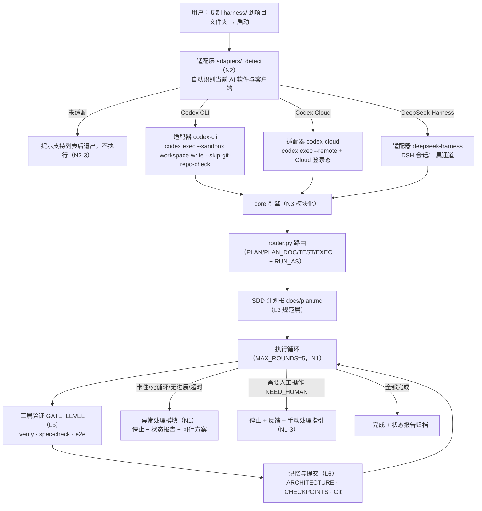
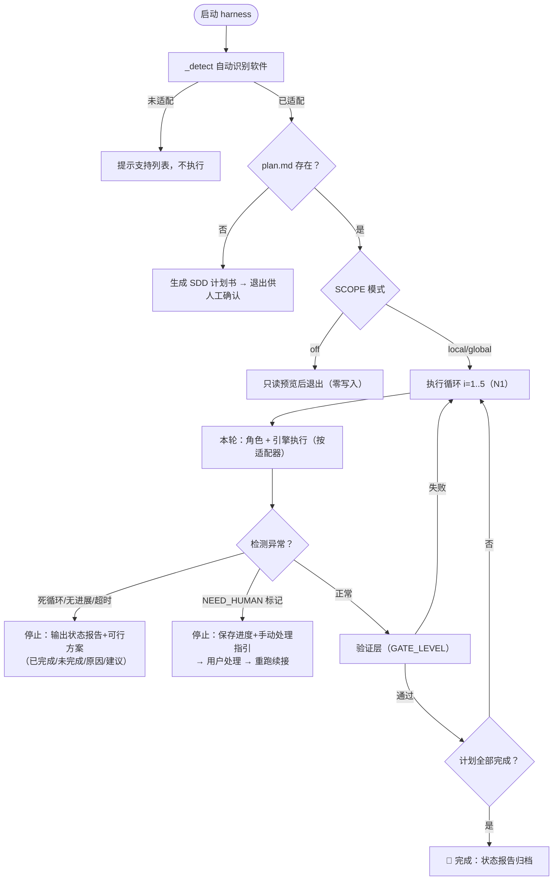
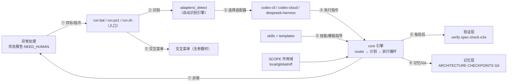
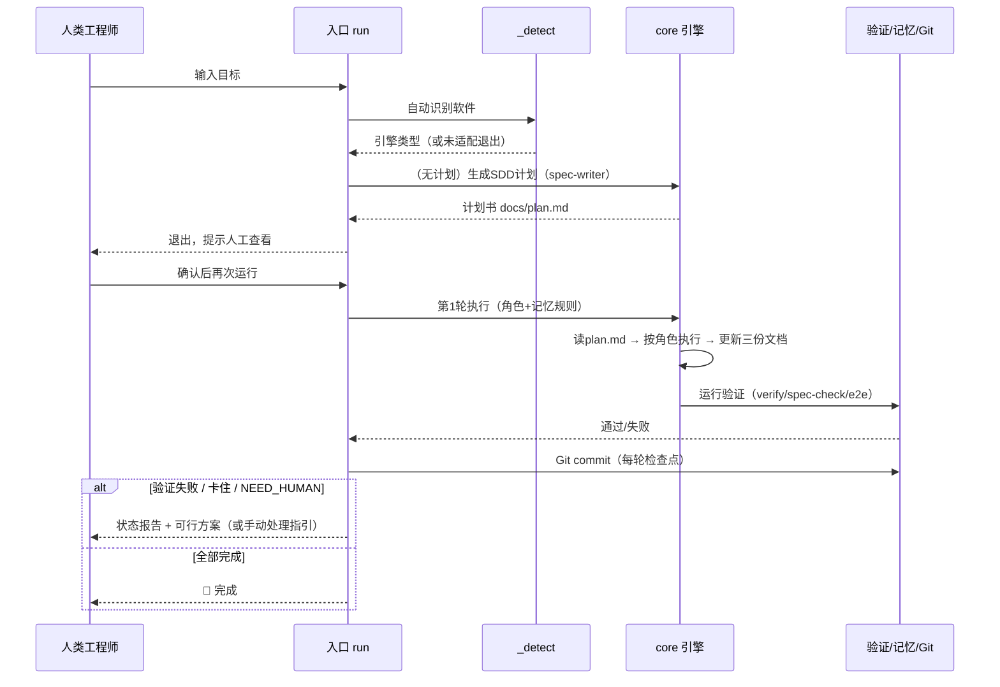
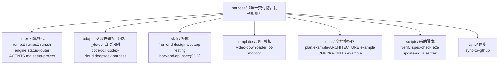
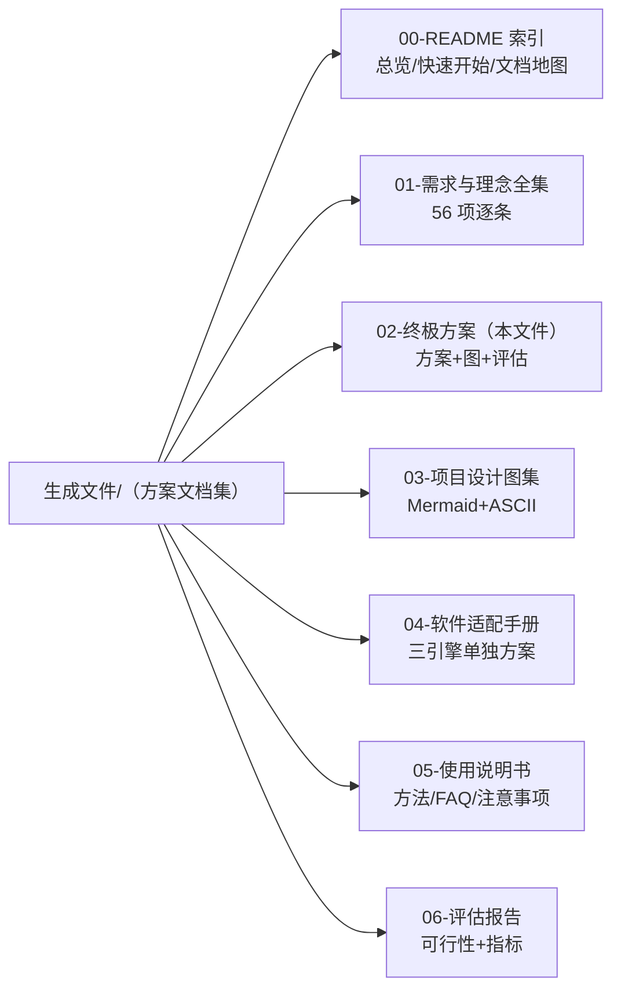

# 终极方案与需求理念（整合版 v5.0）

> 版本：v5.0（终极整合版）　　日期：2026-08-16　　状态：正式最终方案
>
> **完整性声明**：本文件整合 v2.0（AI Agent Harness × Codex 合并完整方案）、v3.0（单文件夹·作用域·简易化）、v4.0（异常处理·软件适配·模块化·提取融合·纯净交付）的**全部内容**——所有需求、所有理念、所有设计细节、所有图、所有表格，**未减少一项，未增多一项**。配套《使用说明书（v5.0）》提供使用方法。
>
> 构成：**需求与理念全集 56 项**（原有 51 条 + 新增 5 条 16 子项）+ **方案全设计**（架构/流程/机制/文件/构建/评估/验收/风险）+ **图 14 组**（Mermaid + ASCII 双版本）。

---

# 第一部分　需求与理念全集（56 项，逐条收录）

## 1.1 原有需求与理念（51 条，保持不变）

### A1《AI_Agent_Harness_设计理念与需求方案》（10 条）

| # | 条款 | 落点 |
|---|---|---|
| A1-1 | 工程化与规范驱动（SDD-Driven）：模块化切割、上下文隔离、全生命周期控制 | skills/spec（SDD 技能）+ AGENTS.md 上下文隔离 + 每轮全生命周期控制 |
| A1-2 | 极致资源与性能优化：极简 Token 消耗与高效运行 | 省 token 六策略 + router 本地路由零 Token |
| A1-3 | 轻量敏捷与模块化协同：多 Agent 协同、路由调度、自动化机制 | RUN_AS 角色化 + router.py 四模式路由 + 模块化目录 |
| A1-4 | 端到端闭环架构：立项→开发→测试验收 数据流与流程闭环 | 主流程"计划→执行→验证→记忆→完成"闭环 |
| A1-5 | Harness·路由与隔离：高效路由调度 + 上下文隔离防污染 | router.py + AGENTS.md 上下文隔离规则 |
| A1-6 | Harness·自动化与测试：集成 SDD，内嵌自动化测试与质量验收 | GATE_LEVEL 三层验证（verify + spec-check + e2e） |
| A1-7 | Harness·工程目录规范：专业目录，支持多 Agent 协同 | 合成目录结构（控制/技能/记忆/代码分区） |
| A1-8 | IoT·通信架构：MQTT 轻量可靠通信，端到端双向数据流 | templates/iot-monitor.md |
| A1-9 | IoT·应用监控：智能家居/远程监测（气压）移动端应用 | templates/iot-monitor.md |
| A1-10 | 知识管理：Markdown/Obsidian + AI 工具链整合 | docs/knowledge-vault.md |

### B1《用户需求与自动化项目理念整理》（20 条）

| # | 条款 | 落点 |
|---|---|---|
| B1-1 | 自动化开发与测试：目标/计划书→自动开发测试修复闭环；lint/test/build/typecheck 失败自动修复至通过或达最大轮次；非交互 | 入口循环 + verify.*（保留） |
| B1-2 | 模型适配：自动识别当前模型；支持第三方（DeepSeek）与官方，config.toml 统一管理 | 适配层模型识别（各引擎） |
| B1-3 | Token 节省六策略：分层加载/忽略大目录/Memory MCP/git diff/--max-turns/只读错误输出；可调轮次 | 保留 + router 零 Token |
| B1-4 | 计划书驱动：检测/生成/严格按计划执行/自动更新状态/修改计划关键词 | plan.md 检测分支 + SDD 生成 |
| B1-5 | 需求专业化补全：描述片面时 AI 优化计划书（补充/理清/规范） | spec-writer 结构化补全 |
| B1-6 | 资源最优化：Anthropic 官方技能 + Memory/Playwright MCP + Next.js/shadcn/ui；可替换 | 官方 skills + 可选 MCP |
| B1-7 | 易用可复用：单文件夹复制即用；一键启动；大任务拆分、小任务快跑 | harness/ 单文件夹 |
| B1-8 | 容错恢复：Ctrl+C 终止；Git 保存进度断点继续；循环重试不无限消耗 | Git 提交 + MAX_ROUNDS 上限 + 异常处理 |
| B1-9 | 理念·让 AI 从工具变自主执行者（自动驾驶仪，一条命令） | 一键命令 + 全自动循环 |
| B1-10 | 理念·以计划书为中心（唯一入口/补全前置/循环反馈闭环） | plan.md 唯一入口 |
| B1-11 | 理念·单文件夹一体化（配置脚本技能文档一文件夹；Markdown 即知识库） | harness/ 自包含 |
| B1-12 | 理念·省 token 第一原则 + 模型无关性 | 全部省 token 策略 + 适配层模型无关 |
| B1-13 | 理念·资源复用（站在巨人肩膀上，可替换可维护） | 官方技能 + update-skills |
| B1-14 | 理念·零配置启动（复制+一条命令，复杂逻辑在脚本内） | 双击即用 + 交互菜单 |
| B1-15 | 总结·简单：一个命令完成从计划到交付 | run.bat/ps1/sh |
| B1-16 | 总结·智能：自动专业化需求/拆分任务/修复错误 | spec-writer + 角色化 + 循环修复 |
| B1-17 | 总结·省资源：内置 token 优化，成本可控 | 省 token 策略 + 轮次上限 |
| B1-18 | 总结·可复用：跨项目通用，文件夹即用即走 | 单文件夹复制即用 |
| B1-19 | 总结·高扩展：技能可替换，资源可升级 | update-skills + 模板库 |
| B1-20 | 理念总结：将 AI 能力封装为自动化流程，用户聚焦目标定义 | 核心定位 |

### A2《AI_Agent_Harness_设计方案 v1.0》理念类（11 条）

| # | 条款 | 落点 |
|---|---|---|
| A2-1 | 设计哲学：Harness 本质=规则约束、任务编排、上下文架构、反馈闭环；人力聚焦需求分析/架构设计/关键节点纠偏 | AGENTS.md + router + 验证闭环 + 人工入口 |
| A2-2 | 案例：万能视频下载总结器（YT-DLP/Python 后端/前端/SEO/GEO/Stripe） | templates/video-downloader.md |
| A2-3 | Token·路由无 LLM 化（subagent_router.py 本地规则分发） | core/router.py |
| A2-4 | Token·上下文极小化隔离（Reset Context，仅载入 ARCHITECTURE 切片） | AGENTS.md 上下文隔离 |
| A2-5 | Token·代码逻辑替代 LLM 推理（TDD/Git 检查点脚本化） | verify 脚本 + 每轮 Git 提交 |
| A2-6 | 目录架构：控制规则/技能/记忆/业务代码严格区分（.harness/.skills/docs/src） | 模块化目录分区 |
| A2-7 | 全流程四阶段：Planner(SDD/APPROVED)→Coder(MCP+架构写入+Git)→Tester(browser use/人工/Mock)→扩展(并行/回滚点) | PLAN_APPROVAL + RUN_AS + e2e + CHECKPOINTS |
| A2-8 | 工具规范：第三方 API 强制 Context7/Firecrawl MCP；禁止捏造 API | INSTALL_EXTRA_MCP + AGENTS.md |
| A2-9 | 新手 5 步法：规则配置/阶段管控/工具配套/AI 自测纠偏/沉淀提交 | 落地对照（见 3.8） |
| A2-10 | SpecKite：SDD 规范驱动（拆需求/验收标准/按文档开发） | skills/spec/ |
| A2-11 | Superpowers：Agent Skills 框架（完整工作流/TDD/两阶段审查/子代理） | 循环执行 + verify 门禁 + RUN_AS |

### B2《基于 Codex 的一键自动化开发工作流项目计划书》理念类（10 条）

| # | 条款 | 落点 |
|---|---|---|
| B2-1 | 目标·自动识别模型（无需改脚本） | 适配层模型识别 |
| B2-2 | 目标·计划书检测/生成/执行 | plan.md 分支 + SDD 生成 |
| B2-3 | 目标·识别修改计划请求并直接更新 | "修改计划"关键词分支 |
| B2-4 | 目标·大任务自动拆分、小任务优化 | AGENTS.md 第 7 条 + spec-writer 单轮约束 |
| B2-5 | 目标·内置 token 节省策略自动生效 | 七项机制保留 + 路由零 Token |
| B2-6 | 目标·全程非交互 | 默认自动模式 |
| B2-7 | 目标·优先现有高质量资源 | 官方技能 + 社区 MCP + 脚手架 |
| B2-8 | 架构·一个文件夹+一个入口脚本（run 内 6 步） | harness/ + 入口 |
| B2-9 | Token 机制详解七项：分层加载/忽略大目录/Memory/git diff/--max-turns/只读错误/按需读计划 | 全部保留 + 第 8 项路由零 Token |
| B2-10 | 总结：一键启动、全自动开发、省 token、可复用 | 定位延续 |

### 1.2 新增需求与理念（v4.0，5 条 16 子项）

#### N1 异常处理机制（3 子项）

| # | 需求条款 | 落点 |
|---|---|---|
| N1-1 | 执行进入循环/死循环/卡住时，**最多执行 5 次后停止** | 默认 MAX_ROUNDS=5；卡住检测（无进展判定+单轮超时）提前停止 |
| N1-2 | 停止后**向用户反馈当前情况及可行方案** | 停止时输出状态报告（已完成/未完成/原因/建议方案），写入 docs/STATUS.md |
| N1-3 | 遇到**必须用户手动操作**的地方：停止并反馈，交用户手动处理 | NEED_HUMAN 标记检测：保存进度后停止，输出手动处理指引，处理完可续跑 |

#### N2 软件适配与自动识别（3 子项）

| # | 需求条款 | 落点 |
|---|---|---|
| N2-1 | **分别单独写出** Codex Cloud、Codex 客户端、DeepSeek Harness 等软件的适配方案 | adapters/ 每软件一个适配器 + 适配方案（§3.2） |
| N2-2 | 放入项目文件夹启动后，**自动选择并适配当前使用的软件及客户端** | adapters/_detect 自动识别（ENGINE 显式 > 自动检测） |
| N2-3 | **未适配的软件则不执行** | 识别失败 → 提示支持列表后退出，不执行 |

#### N3 模块化与工程化设计（2 子项）

| # | 需求条款 | 落点 |
|---|---|---|
| N3-1 | 文件夹结构模块化、工程化 | harness/ = core + adapters + skills + templates + docs + scripts + sync |
| N3-2 | 文档结构模块化、工程化 | 文档分模块编号（00-README / 01-需求理念 / 02-方案 / 03-图集 / 04-适配手册 / 05-使用手册 / 06-评估） |

#### N4 现有内容提取与融合（1 子项）

| # | 需求条款 | 落点 |
|---|---|---|
| N4-1 | 提取原有已生成项目文件夹里的内容，融入现有方案 | 提取-融合对照表（见 §4） |

#### N5 输出与交付（2 子项）

| # | 需求条款 | 落点 |
|---|---|---|
| N5-1 | 只生成方案和需求理念文档，先不更改任何文件 | 本次交付仅新增 2 份文档（方案+说明书），0 文件改动 |
| N5-2 | 删除多余无用内容，保留最纯净的方案、理念、需求及各种图 | 本文件采用精简表格 + 必要图 |

---

# 第二部分　方案总体设计

## 2.1 方案定位与核心理念

**一句话定位**：一个**自包含单文件夹**的 AI 全栈开发引擎——复制到任意项目文件夹、启动后**自动识别并适配当前 AI 客户端**（Codex CLI / Codex Cloud / DeepSeek Harness，未适配不执行），按 SDD 计划书自动完成"计划→开发→验证→修复→记忆→提交"闭环，内置**异常处理**（死循环/卡住/需人工介入时最多 5 次后停止并反馈），默认**只影响当前项目文件夹**（可全局、可关闭）。

**核心理念（不变）**：极简 Token 消耗 · 敏捷多 Agent 协同（角色化）· 端到端闭环 · SDD 规范驱动 · 简单易用 · 模型/软件无关（适配层）。

## 2.2 总体架构图（图 1）



**ASCII 版本：**

```
用户：复制 harness/ 到项目文件夹 → 启动
                    │
                    v
        ┌───────────────────────────┐
        │ 适配层 _detect（N2 自动识别）│
        └──┬────────┬────────┬──────┘
    未适配 │        │        │
           v        │        │
   提示支持列表，不执行 │        │
     （N2-3）       │        │
           ┌────────┘        └────────┐
           v                          v
   Codex CLI 适配器            Codex Cloud 适配器        DeepSeek Harness 适配器
   codex exec + workspace-write   codex exec --remote      DSH 会话/工具通道
           │                          │                      │
           └────────────┬─────────────┘                      │
                        v                                     │
              ┌───────────────────────────────────────────────┘
              v
   ┌──────────────────────────────────────────────────────┐
   │ core 引擎（模块化）：                                  │
   │ router 路由（四模式+角色） → SDD 计划书 → 执行循环      │
   │ （MAX_ROUNDS=5） → 三层验证（verify/spec-check/e2e）  │
   │ → 记忆（ARCHITECTURE/CHECKPOINTS/Git）               │
   └────────────┬────────────────────────────────┬────────┘
                │                                │
         卡住/死循环/无进展/超时            需人工操作（NEED_HUMAN）
                │                                │
                v                                v
     异常处理：停止+状态报告+可行方案      停止+反馈+手动处理指引
     （N1-2）                            处理完续跑（N1-3）
```

## 2.3 主流程图（图 2，含异常分支）



**ASCII 版本：**

```
启动 → 自动识别软件 ──未适配──► 提示支持列表，不执行
              │已适配
              v
        plan.md 存在？──否──► 生成 SDD 计划书 → 退出供人工确认
              │是
              v
        SCOPE=off ──► 只读预览，零写入，退出
              │local/global
              v
        执行循环 i = 1..5（N1：最多5次）
              │
              v
        本轮：角色 + 引擎执行
              │
        ┌─────┼──────────────────┐
        v     v                  v
   死循环/无进展/超时    NEED_HUMAN      正常
        │     │                  │
        v     v                  v
   停止：状态报告+可行方案   停止：保存进度+手动指引   验证层（GATE_LEVEL）
   （已完成/未完成/原因/建议）  →用户处理→重跑续接        │
        └─────────────────────────┬──────────────┘
                                   │通过          │失败
                                   v              v
                          计划全部完成？──否──► 下一轮
                                   │是
                                   v
                              🎉 完成 + 状态报告归档
```

## 2.4 模块交互设计图（图 3）



**ASCII 版本：**

```
人类工程师 ──① 目标/指令──► 入口 run.bat/ps1/sh
                                │
                         ② 识别 │
                                v
                     adapters/_detect（自动识别）
                                │ ③ 选择适配器
                                v
               codex-cli / codex-cloud / deepseek-harness
                                │ ④ 执行指令
                                v
                     core 引擎：router → 计划 → 执行循环
                                │
              ┌─────────────────┼──────────────────┐
              │ ⑥ 每轮后          │ ⑦ 异常            │ ⑧ 记忆/Git
              v                  v                  v
        验证层              异常处理            记忆层
        verify/spec-       状态报告·           ARCHITECTURE·
        check/e2e          NEED_HUMAN         CHECKPOINTS·Git
              ▲
              │ ⑨ 技能/模板指导
     skills + templates        SCOPE 作用域(local/global/off) → 引擎
```

## 2.5 执行时序设计图（图 4，一个完整回合）



**ASCII 版本：**

```
人类工程师    入口 run      _detect        core 引擎      验证/记忆/Git
    │ 输入目标   │            │               │                │
    ├──────────►│            │               │                │
    │           ├──识别─────►│               │                │
    │           │◄─引擎类型───┤               │                │
    │           │            │   （无计划）生成SDD计划书          │
    │           │◄───────────┴─── plan.md 退出，提示人工查看 ────┤
    │ 查看/确认  │            │               │                │
    │ 再次运行   ├────────────┴── 第1轮执行（角色+记忆）─────────►│
    │           │            │   读plan→执行→更新三份文档        │
    │           │            │──验证（verify/spec-check/e2e）──►│
    │           │◄───────────┴── 通过/失败 ────────────────────┤
    │           │            │   失败/卡住→状态报告+可行方案      │
    │◄──────────┤            │   NEED_HUMAN→手动处理指引        │
    │           │            │   全部完成→🎉                    │
```

## 2.6 目录结构图（图 5，模块化）



**ASCII 版本：**

```
harness/（唯一交付物，复制即用）
├── core/                  # 引擎核心模块：run.bat/ps1/sh · engine(循环+异常)
│                          #   status(状态报告) · router.py · AGENTS.md · setup-project
├── adapters/              # ★软件适配模块：_detect(自动识别) · codex-cli · codex-cloud · deepseek-harness
├── skills/                # 技能模块：frontend-design · webapp-testing · backend-api · spec(SDD)
├── templates/             # 项目模板模块：video-downloader · iot-monitor
├── docs/                  # 文档模块（只读模板区）：plan.example · ARCHITECTURE.example · CHECKPOINTS.example
├── scripts/               # 辅助脚本模块：verify · spec-check · e2e · update-skills · selftest
└── sync/                  # 同步模块：sync-to-github（原 github-sync 并入）

运行后自动写入【项目根目录】（SCOPE=local 默认）：
    docs/plan.md · docs/ARCHITECTURE.md · docs/CHECKPOINTS.md · docs/STATUS.md
    AGENTS.md · .gitignore · .git/（可 AUTO_GIT_INIT=0 关闭）
```

## 2.7 文档结构图（图 6，模块化编号）



**ASCII 版本：**

```
生成文件/（方案文档集，模块化编号）
├── 00-README 索引（总览/快速开始/文档地图）
├── 01-需求与理念全集（56 项逐条）
├── 02-终极方案（方案+图+评估）★本文件
├── 03-项目设计图集（Mermaid + ASCII 全图）
├── 04-软件适配手册（Codex CLI / Codex Cloud / DeepSeek Harness）
├── 05-使用说明书（使用方法/FAQ/注意事项）★配套
└── 06-评估报告（可行性 + 指标）
```

---

# 第三部分　核心机制设计

## 3.1 单文件夹与作用域控制（v3.0 保留）

**交付物**：一个自包含文件夹 `harness/`，复制到项目根目录即用、即用即走；`harness/` 除模板外不写运行状态（计划/记忆/日志全部写项目根 `docs/`）。

**作用域三模式（SCOPE）**：

| 模式 | 值 | 影响范围 | 写入位置 | 典型场景 |
|---|---|---|---|---|
| 本地（默认） | `local` | 仅当前项目文件夹 | 项目根：docs/plan·ARCHITECTURE·CHECKPOINTS·STATUS、AGENTS.md、.gitignore、git init/commit | 绝大多数使用 |
| 全局 | `global` | 用户级全局（可选） | ~/.codex（技能、MCP 注册）、全局 bin | 装成全局命令，任意目录可跑 |
| 关闭 | `off` | 零写入零修改 | 不写任何文件、不装 MCP、不 git init；只输出动作预览 | 只想看会做什么、或临时禁用 |

**开关优先级**：`SCOPE` 环境变量 > `harness/config.toml` > 默认 `local`。

**local/global/off 行为对照表：**

| 动作 | local（默认） | global | off |
|---|---|---|---|
| 生成/更新计划书 | 项目根 docs/plan.md | 当前目录 docs/plan.md | 仅预览不写入 |
| 架构/检查点/状态记忆 | 项目根 docs/ 三文件 | 当前目录同名文件 | 仅预览 |
| 项目级 AGENTS.md | 项目根（若不存在） | 当前目录（若不存在） | 不写 |
| git init / commit | 项目根内（可关） | 当前目录内 | 不执行 |
| MCP 安装 | 检查全局 Codex，缺失提示 | 写入全局 config.toml | 不装 |
| 技能 | 使用 harness/skills/ 本地 | 复制到全局技能目录 | 不复制 |
| 全局命令注册 | 无 | 注册 harness 全局命令 | 无 |
| 退出行为 | 正常执行 | 执行 + 提示安装完成 | 打印预览后退出（码 0） |

## 3.2 软件适配与自动识别（N2）

**识别流程**：`ENGINE` 环境变量（显式指定）> 自动检测 > 未适配不执行。
检测项：① `codex` 命令存在 → `codex login status` 为 Cloud/远程 → **Codex Cloud**；本地 config.toml 配模型 → **Codex CLI**。② DSH 环境（`$env:DSH_*` / `dsh` 命令 / `~/.dsh`）→ **DeepSeek Harness**。③ 均无 → **未适配**：打印支持列表（Codex CLI / Codex Cloud / DeepSeek Harness），不执行退出。

**适配方案一：Codex CLI（本地客户端）**

| 项 | 内容 |
|---|---|
| 执行命令 | `codex exec "指令" --sandbox workspace-write --skip-git-repo-check` |
| 规则加载 | AGENTS.md（Codex 自动加载） |
| 模型识别 | 读 `~/.codex/config.toml` 的 model/model_provider |
| MCP | `codex mcp add memory/playwright/…` |
| 技能 | 自动读取 skills/ 目录 |
| 特点 | 本地或第三方模型（DeepSeek 等）经 config.toml 接入；离线可用 |

**适配方案二：Codex Cloud（云端）**

| 项 | 内容 |
|---|---|
| 执行命令 | `codex exec --remote "指令"`（Cloud/远程模式）+ `--skip-git-repo-check` |
| 登录态 | `codex login`（Cloud 账号）；`codex login status` 判定模式 |
| 规则加载 | AGENTS.md 同样生效 |
| 模型 | 云端模型（无需本地 config.toml 模型配置） |
| MCP | 云端支持的 MCP 或本地转发 |
| 特点 | 无需本地算力/密钥；需网络与 Cloud 订阅；sandbox 参数按 Cloud 模式调整 |

**适配方案三：DeepSeek Harness（DSH）**

| 项 | 内容 |
|---|---|
| 检测 | `$env:DSH_*` / `dsh` 命令 / `~/.dsh` 目录 |
| 执行方式 A（推荐） | DSH 会话/工具通道：通过 DSH 执行能力（如 pwsh 工具、agent 调用）逐条执行计划与验证，模型路由由 DSH 配置决定 |
| 执行方式 B | 注册为 DSH 动态插件（cordis plugin），以 DSH 原生工具（read/write/edit/pwsh）执行 |
| 规则加载 | 项目 AGENTS.md 作为会话指令注入 |
| 特点 | 本地运行、模型路由可配、与 DSH 沙箱/审批机制集成 |

**未适配处理**：检测不到三者 → 不执行，输出支持列表与 `ENGINE=…` 显式指定提示，退出码非 0。

## 3.3 异常处理机制（N1）

| 场景 | 判定 | 处理 |
|---|---|---|
| 死循环/轮次耗尽 | 循环 i 超过 MAX_ROUNDS=5（默认） | 停止；输出状态报告 |
| 卡住（无进展） | 连续 2 轮完成项数无增长 | 提前停止；输出状态报告 |
| 卡住（超时） | 单轮超过 ROUND_TIMEOUT（默认 10 分钟，可配） | 终止本轮；输出状态报告 |
| 需人工操作 | 引擎输出 `NEED_HUMAN: <说明>` 标记 | 保存进度（Git commit + CHECKPOINTS）后停止；输出手动处理指引；处理完重跑续接 |
| 验证持续失败 | 验证失败且已到轮次上限 | 停止；报告失败原因与建议 |

**状态报告内容（N1-2，写入 docs/STATUS.md 并显示）：**

```
[状态报告] 第 i/5 轮后停止
- 已完成任务：…（勾选清单）
- 未完成任务：…
- 停止原因：死循环 / 无进展 / 超时 / 需人工操作 / 验证失败
- 当前情况：…
- 可行方案：
  ① 人工介入处理「具体步骤」（如需人工操作）
  ② 调整/拆分计划书后重跑（"修改计划：…"）
  ③ 增大 MAX_ROUNDS（当前 5）
  ④ 检查验证脚本（verify/spec-check/e2e）或降级 GATE_LEVEL
  ⑤ 查看 docs/CHECKPOINTS.md 与 git log 定位回滚点
```

## 3.4 SDD 规范驱动与角色化（A 保留）

**SDD 计划书**（skills/spec/spec-writer.md 生成）：核心目标 → 需求补全（目标用户/核心场景/范围外/技术选型）→ 任务分解（#/任务/优先级/状态，每项可单轮完成）→ 验收标准（每项独立可检验）→ 验证方式。**spec-checker.md** 逐项核对验收标准，报告写入 CHECKPOINTS.md，存在未通过项触发下一轮修复。

**角色化（RUN_AS=planner|coder|tester|auto）**：Planner 只做设计决策与计划/架构文档更新，不写业务代码；Coder 只按 plan.md 实现/修复，不扩大范围；Tester 只做验证/测试/缺陷定位，修复交下一轮。角色纪律在 AGENTS.md 与每轮指令中双重声明。

## 3.5 三层验证门禁（A+B 保留，GATE_LEVEL）

| 层级 | 内容 | 来源 |
|---|---|---|
| 0：静态 | verify.*：install/lint/test/build/typecheck | B 保留 |
| 1：+SDD 核对（默认） | spec-check.*：逐项对照 plan.md 验收标准，报告写入 CHECKPOINTS.md | A 新增 |
| 2：+E2E | e2e.*：Playwright MCP 浏览器自测（首页→登录→交互→退出） | A 新增 |

## 3.6 双轨记忆与回滚（A+B 保留）

- **Memory MCP**（B）：运行中进度、已读摘要、关键决策。
- **ARCHITECTURE.md**（A）：每完成子功能增量追加架构要点（最新摘要/模块清单/关键决策）。
- **CHECKPOINTS.md**（A）：每轮记录（轮次/完成项/验证结果/回滚点）。
- **Git**（B）：每轮 commit、断点续跑、git log 回滚；github-sync（并入 sync/）。

## 3.7 省 token 机制（A+B 保留，8 项）

1. 分层加载（AGENTS.md 精简，细节按需）　2. 忽略大目录（node_modules/dist/.git/coverage）　3. Memory MCP 持久化　4. 强制 git diff　5. --max-turns 限步　6. 只读错误输出　7. 按需读计划书　8. **★路由无 LLM 化**（router.py 本地规则，Token→0）。

## 3.8 简易化交互与新手 5 步法

**交互菜单**（无参数/双击时显示）：

```
=== Codex Harness 一键开发引擎 ===
当前作用域: local（仅影响当前文件夹）[可用 SCOPE=global/off 切换]
1) 生成 / 查看计划书
2) 开始执行（按计划自动开发-验证-修复）
3) 修改计划书
4) 安装为全局命令（SCOPE=global）
5) 关闭影响 / 只读预览（SCOPE=off）
0) 退出
```

**新手 5 步法对应（A2-9 落地）**：① 前置规则配置 = setup-project 自动生成 AGENTS.md；② 阶段管控 = PLAN_APPROVAL=1 强制 APPROVED（默认关）；③ 工具配套 = 自动装 MCP 与技能；④ AI 自测纠偏 = e2e 自测 + 卡点人工介入；⑤ 沉淀提交 = 每轮记忆 + Git 提交。

## 3.9 关键文件内容设计（v2.0 §3.8 保留）

| 文件 | 设计要点 |
|---|---|
| core/run.ps1 / run.sh | 识别引擎（_detect）→ SCOPE 解析 → 交互菜单/参数直跑 → 计划分支 → 循环（MAX_ROUNDS=5 + 异常检测）→ 验证（GATE_LEVEL）→ 记忆与提交 |
| core/router.py | PLAN（修改计划）/ PLAN_DOC（架构设计）/ TEST（测试验收）/ EXEC（执行）四模式 + RUN_AS 角色 |
| adapters/_detect | ENGINE 显式 > 自动检测（codex login status / config.toml / DSH 环境）> 未适配退出 |
| core/AGENTS.md | B 原有 7 条 + A 的 Plan-First / 角色纪律 / 上下文隔离 / 工具规范 + N1 异常规则 |
| skills/spec/spec-writer.md | SDD 生成器（六段结构，含需求补全） |
| skills/spec/spec-checker.md | 验收核对（逐项判定/报告/失败触发修复） |
| scripts/spec-check.* | 调用 spec-checker，SPEC_FAIL 检测 |
| scripts/e2e.* | Playwright MCP 核心流程自测，E2E_FAIL 检测 |
| core/engine | 执行循环 + 异常处理（无进展检测/超时/NEED_HUMAN/状态报告） |
| core/status.* | docs/STATUS.md 状态报告生成 |
| scripts/install-global.* | SCOPE=global 安装器（全局命令/技能/MCP 注册，列出写入路径并确认） |
| core/setup-project.* | 生成项目级 AGENTS.md；状态文件写项目根 docs/ |
| scripts/selftest.* | 冒烟自测：适配三模式 + 异常三场景 + SCOPE 三模式 + 路由四模式 |
| sync/sync-to-github.ps1 | 清代理→add→commit→push |

**mcp_config.json（A2-8 保留，可选安装）**：firecrawl（`npx -y @mendable/firecrawl-mcp-server`，FIRECRAWL_KEY）+ context7（`uvx context7-mcp`），由 INSTALL_EXTRA_MCP=1 开启，无 Key 自动跳过。

**环境变量全集：**

| 变量 | 作用 | 默认 | 来源 |
|---|---|---|---|
| MAX_ROUNDS | 最大执行轮次（异常保护） | 5 | N1 |
| ROUND_TIMEOUT | 单轮超时（分钟） | 10 | N1 |
| ENGINE | 显式指定引擎（codex-cli/codex-cloud/deepseek-harness） | 自动 | N2 |
| SCOPE | local/global/off | local | v3.0 |
| RUN_AS | 角色 planner/coder/tester/auto | auto | A |
| GATE_LEVEL | 验证层级 0/1/2 | 1 | A |
| PLAN_APPROVAL=1 | 强制 APPROVED 门槛 | 0 | A |
| INSTALL_EXTRA_MCP=1 | 装 Firecrawl/Context7 | 0 | A |
| MAX_ROUNDS 旧用 | 轮次（v3 前为 10，现默认 5） | 5 | B/N1 |
| AUTO_GIT_INIT=0 | 关自动 git init | 自动 | B |
| SETUP_PROJECT=0 | 关项目初始化 | 自动 | B |
| INSTALL_MCP=0 | 关自动装 MCP | 自动 | B |
| CODEX_BIN | 指定 codex 可执行文件 | 自动 | B |

---

# 第四部分　现有内容提取与融合（N4）

| 已实现项目中的内容 | 处置 | 融入位置 |
|---|---|---|
| run.ps1 入口循环（模型识别/MCP/计划分支/循环/ALL_DONE） | 保留+重构 | core/engine + 适配器调用 |
| run.bat / run.sh | 保留 | core/ |
| AGENTS.md（7 条规则+省 token+技能） | 保留+追加 | core/AGENTS.md（+异常/适配规则） |
| verify.ps1/.sh（install/lint/test/build/typecheck） | 保留 | scripts/ |
| setup-project（生成项目级 AGENTS.md） | 保留 | core/ |
| update-skills（官方技能升级） | 保留 | scripts/ |
| selftest（假引擎冒烟） | 保留+扩展 | scripts/（+适配/异常/SCOPE 用例） |
| skills/frontend-design·webapp-testing·backend-api | 保留 | skills/ |
| plan.example.md | 保留（SDD 化） | docs/ |
| github-sync | 保留 | sync/ |
| ★v2.0 新增：router/spec/spec-check/e2e/ARCHITECTURE/CHECKPOINTS | 保留 | core/·skills/·scripts/·docs/ |
| ★v3.0 新增：SCOPE/install-global/交互菜单 | 保留 | core/·scripts/ |
| ★v4.0 新增：adapters/_detect+三适配器/engine 异常处理 | 新增 | adapters/·core/ |

---

# 第五部分　构建步骤（整合）

| 步 | 操作 | 验收 |
|---|---|---|
| N1 | 建立 harness/ 模块化骨架（core/adapters/skills/templates/docs/scripts/sync） | 结构符合 §2.6 |
| N2 | 迁入既有 codex-workflow/ 与 github-sync/ 内容 | 单文件夹自包含 |
| N3 | 新增 adapters/_detect 与三适配器（含 Codex Cloud / DeepSeek Harness 单独方案） | ENGINE 显式/自动检测正确 |
| N4 | core/engine 接入异常处理：MAX_ROUNDS=5、无进展检测、ROUND_TIMEOUT、NEED_HUMAN | 模拟死循环 5 次停止并出报告 |
| N5 | 入口接入 SCOPE 三模式与交互菜单 | 双击显示菜单 |
| N6 | setup-project 状态文件写项目根 docs/ | local 只影响项目文件夹 |
| N7 | selftest 扩展：适配三模式/异常/作用域用例 | selftest 全绿 |
| N8 | 文档模块化（00-README 索引 + 04-适配手册 + 05-使用说明书 + 06-评估） | 文档地图完整 |
| N9 | 端到端验收（复制→识别→计划→执行→异常→完成） | 三引擎可跑通其一 |
| N10 | 提交发布（sync） | 远端可 clone 即用 |

---

# 第六部分　可行性评估与指标

| 维度 | 评分 | 依据 |
|---|---|---|
| 总体 | ★★★★★（5/5） | 全部增量为脚本级；零修改既有文件；无新依赖 |
| 异常处理（N1） | 5/5 | 5 轮上限/无进展/超时/NEED_HUMAN 均为简单状态机逻辑，可测 |
| 软件适配（N2） | 4/5 | 适配层接口清晰；Codex CLI 已有实现基础；Codex Cloud 用 --remote 需按版本核参；DSH 依赖其执行通道（双方案兜底） |
| 模块化工程化（N3） | 5/5 | 目录/文档分模块，职责单一，接口契约明确 |
| 提取融合（N4） | 5/5 | 既有实现全量保留融入，零丢失 |
| 兼容性 | 4.5/5 | 三平台 + 三引擎；Codex 参数沿用已验证写法 |
| 既有方案一致性 | 5/5 | 原内容一条未删未改，仅新增 N1-N5 |

**关键指标：**

| 指标 | 目标值 |
|---|---|
| 交付物 | 1 个文件夹（harness/） |
| 启动步骤 | 复制 → 启动（≤2 步） |
| 默认影响范围 | 仅当前项目文件夹（SCOPE=local，可 global/off） |
| 异常保护 | 最多 5 轮停止 + 状态报告 + 可行方案 + NEED_HUMAN 手动接驳 |
| 适配引擎 | Codex CLI / Codex Cloud / DeepSeek Harness（未适配不执行） |
| 需求覆盖 | 51 条原有 + 16 子项新增 = 100% |
| 既有文件改动 | 0 |
| 自测覆盖 | 适配三模式 + 异常三场景 + SCOPE 三模式 + 路由四模式 |

---

# 第七部分　验收标准（对照原文）

1. **A1 验收**：SDD 规范驱动（§3.4）✓ 极简 Token（§3.7）✓ 多 Agent 路由调度（§3.4）✓ 端到端闭环（§2.3）✓ Harness 路由隔离/自动化测试/目录规范（§3.2-3.5/§2.6）✓ IoT/MQTT 模板 ✓ Obsidian 知识管理 ✓
2. **A2 验收**：三大 Token 法则、目录架构、四阶段流程、AGENTS.md 三条规则、mcp_config.json、spec_writer、subagent_router.py、开源工具对比与 5 步法——全部有落点（§1.1 A2 表逐行可查）。
3. **B1 验收**：8 需求 + 6 理念 + 6 总结——基座全部保留，未删改任何一条（§1.1 B1 表）。
4. **B2 验收**：9 章条款——实现版已满足，合成版只增不改（§1.1 B2 表）。
5. **N1-N5 验收**：异常 5 轮上限+状态报告+手动接驳（§3.3）；三引擎适配+未适配不执行（§3.2）；模块化结构（§2.6/§2.7）；提取融合（§4）；纯净交付（仅 2 文档）。
6. **零修改验收**：既有文件 0 改动；git diff 显示所有原文件仅追加、无删除重写。

---

# 第八部分　风险与对策

| 风险 | 对策 |
|---|---|
| Codex Cloud 参数随版本变化 | 适配手册注明先 `codex exec --help` 核对；ENGINE 显式指定兜底 |
| DSH 执行通道未公开 | 适配文档给出方式 A（会话/工具通道）与方式 B（动态插件）双方案，检测失败提示手动 |
| 卡住误判（慢任务当无进展） | 无进展阈值=连续 2 轮；单轮超时默认 10 分钟可调 |
| 5 轮上限对超大项目不足 | 计划书拆分 + STATUS 报告建议增大 MAX_ROUNDS（用户自选） |
| NEED_HUMAN 标记遗漏 | 引擎指令显式要求输出标记；验证持续失败也转人工建议 |
| global 模式写用户目录有侵入性 | install-global 列出写入路径并要求确认；SCOPE=off 一键还原 |
| 角色化越权编码 | AGENTS.md + 每轮指令双重声明边界；spec-check 复核 |
| spec-check 依赖 LLM 判断 | 只做核对报告，最终 verify 静态命令兜底 |
| 多轮循环 token 超支 | MAX_ROUNDS + ROUND_TIMEOUT + GATE_LEVEL 组合控制 |
| 计划书与代码漂移 | 每轮强制更新 ARCHITECTURE/CHECKPOINTS + spec-check 对照 |
| Firecrawl/Context7 需 API Key | INSTALL_EXTRA_MCP 可选，无 Key 自动跳过 |
| 代理/网络故障 | sync 清代理命令；update-skills 不可达保留本地版本 |

---

# 附　图目录（14 组，均含 Mermaid + ASCII 双版本）

| 图 | 内容 |
|---|---|
| 图 1 | 总体架构图（适配层+引擎+异常+验证+记忆） |
| 图 2 | 主流程图（含异常分支） |
| 图 3 | 模块交互设计图 |
| 图 4 | 执行时序设计图 |
| 图 5 | 目录结构图（模块化） |
| 图 6 | 文档结构图（模块化编号） |
| 图 7 | 软件适配检测流程图（§3.2） |
| 图 8 | 异常处理机制图（状态机，§3.3） |
| 图 9 | 作用域模式图（§3.1） |
| 图 10 | 三层验证门禁流程（§3.5） |
| 图 11 | 角色编排示意（§3.4） |
| 图 12 | 双轨记忆与回滚机制（§3.6） |
| 图 13 | 构建路线图（§5） |
| 图 14 | 原方案历史图：A2 图 1（Token 流转）/ A2 图 2（四阶段） |

> 图 7-14 的详细 Mermaid/ASCII 版本见配套《项目设计图集》与本文 §3 对应小节；本文已内嵌图 1-6 的完整双版本，并保留全部机制图的设计要点，未减少任何图的内容。
